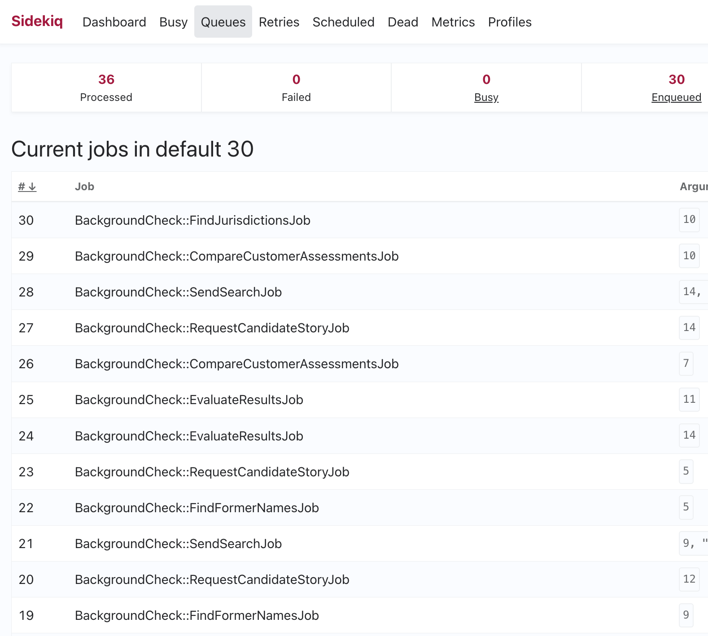
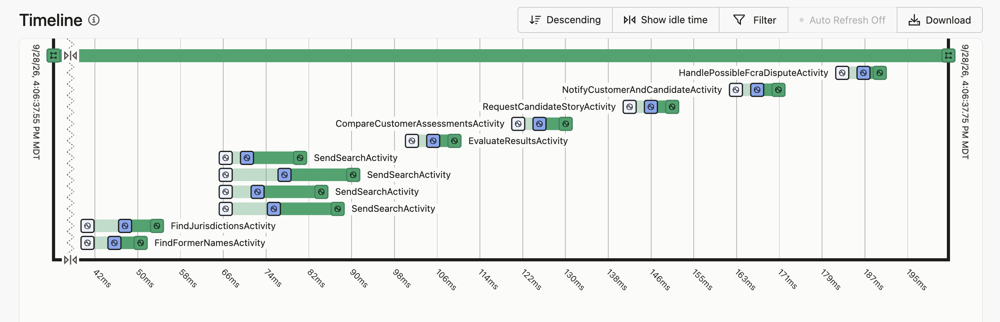
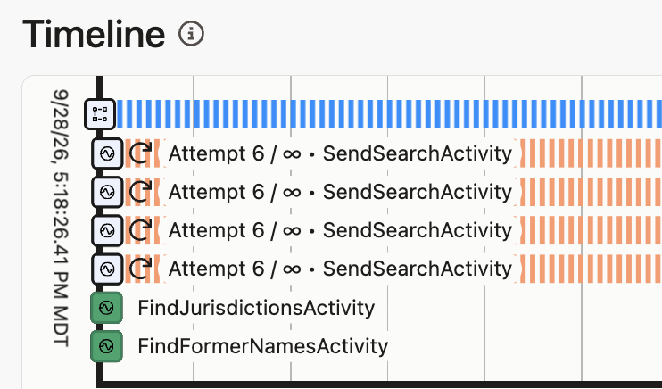
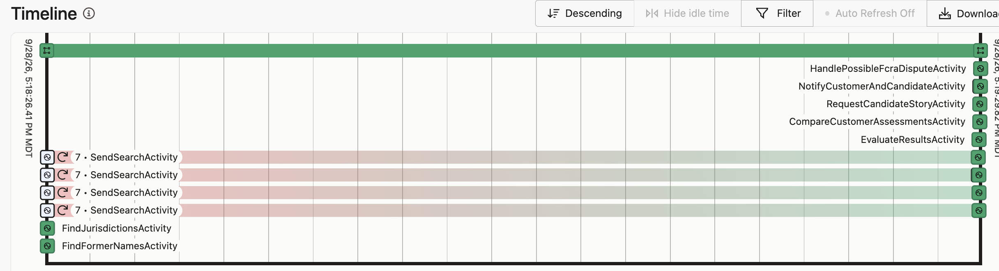
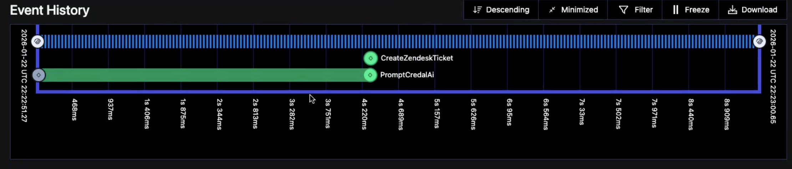
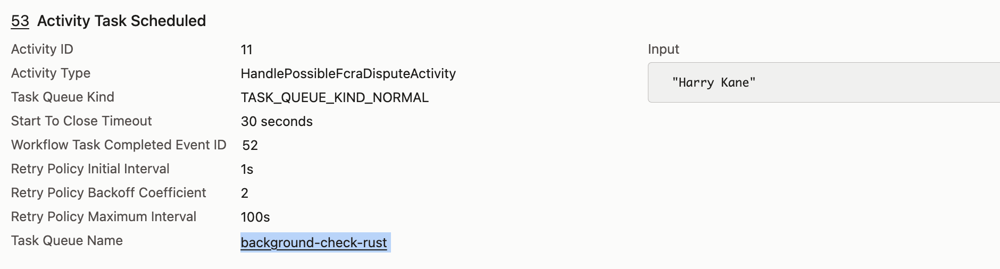
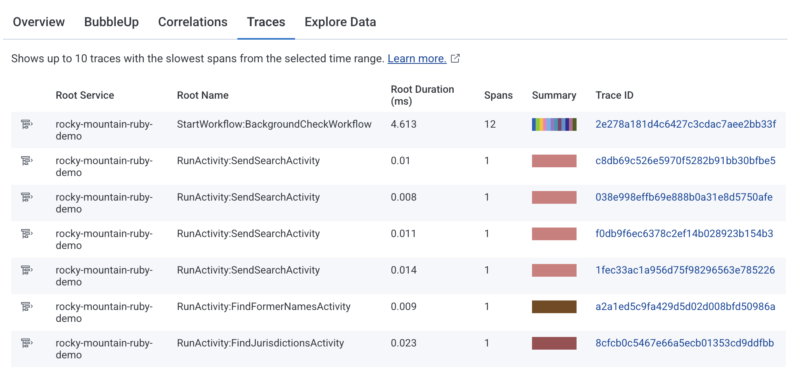
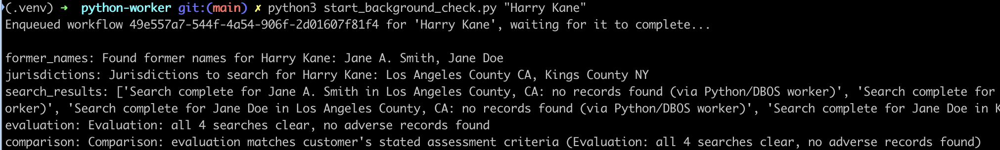

This is a write-up of my Rocky Mountain Ruby 2026 lightning talk.

## The candidates

The November election is a month away. Here are the "candidates":

| Candidate     | Async job library                 | License                   |
| ------------- | --------------------------------- | ------------------------- |
| Incumbent     | Sidekiq                           | MIT                       |
| Challenger    | Temporal                          | MIT                       |
| Up and comers | Postgres-backed durable execution | MIT / Apache 2.0 / varies |

Sidekiq is the Ruby standard for background jobs since 2012.

Temporal is the up-and-comer, with a Ruby-sdk as of September 2025.

The up and comers are a growing group: DBOS, pg_durable by Microsoft, ResonateHQ, Absurd Workflows, Obelis, and others. They promise durable execution managed via a relational database rather than a separate orchestration server.

## The demo

The demo is of running a _background check process_, which is comprised of 10 async jobs that must complete for a Job candidate to be accepted, start work, and get their first paycheck.

The demo ran in Sidekiq, Temporal, and Postgres-backed durable execution (DBOS).

## The incumbent: Sidekiq

Tracing one background check across many jobs is difficult. We call it the "daisy chain", where one `Background Job` triggers another `Background Job`:

## The challenger: Temporal

A Workflow is one thread that ties all the `Activities` together: 

### Durability: configurable retries

Here the `SendSearchActivity` is failing:

After the bug is fixed, the `Activity` and `Workflow` complete successfully:

### Managing agent workflows

Temporal is also a good fit for agent workflows: failing API requests, and remembering the AI conversation context, with ability to resume days or weeks later.

### Cross-language support

The last `Activity` is handled by a Rust worker:

### Traces to Honeycomb

## The up and comers: DBOS

The same background check running as a Postgres-backed DBOS workflow: 

## Election Results

The informal "election" poll at RMR was close. With a plurality although not a majority, the winnner was.... Sidekiq! 🗳️